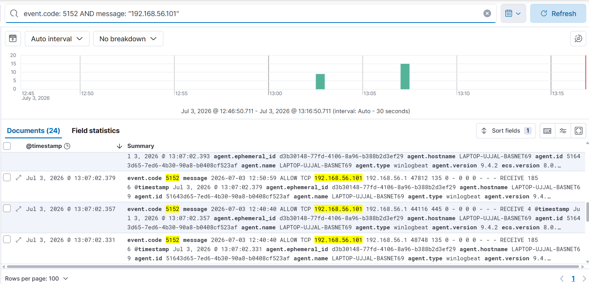
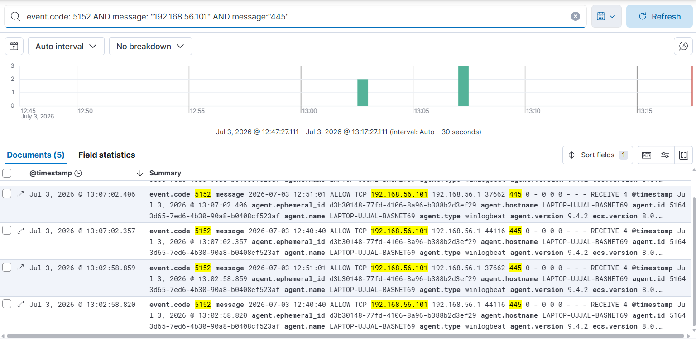
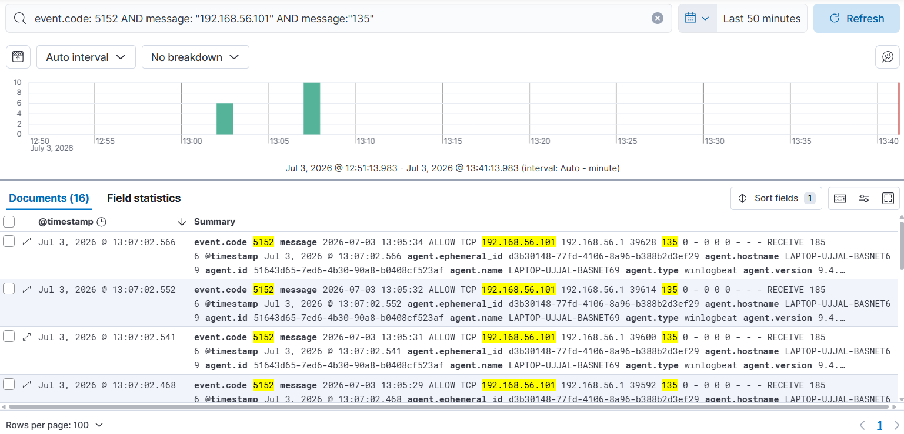

\# Detection Engineering Report #001

\# Network Reconnaissance Detection


\*\*Date:\*\* July 03, 2026

\*\*Analyst:\*\* Ujjal Basnet

\*\*Severity:\*\* MEDIUM


\## Executive Summary

Five different Nmap scan types were simulated from Kali Linux

VM (192.168.56.101) against Windows host (192.168.56.1).

Windows Firewall logging was enabled and logs were shipped to

Elastic SIEM via Winlogbeat. Five KQL detection queries were

built and tested, successfully detecting all scan types.


\## Attack Simulations Performed


| # | Scan Type | Command | Ports Scanned | Logs Generated |

|---|-----------|---------|---------------|----------------|

| 1 | SYN Stealth | nmap -sS | 1-1000 | 2 events |

| 2 | TCP Connect | nmap -sT | 1-1000 | 5 events |

| 3 | NULL Scan | nmap -sN | 1-1000 | 9 events |

| 4 | FIN Scan | nmap -sF | 1-1000 | 9 events |

| 5 | XMAS Scan | nmap -sX | 1-1000 | 9 events |


\*\*Total events captured:\*\* 34 firewall log entries

\*\*Total events in SIEM:\*\* 24 documents (Event ID 5152)


\## Detection Method


\### Step 1 — Enable Windows Firewall Logging

```powershell

netsh advfirewall set privateprofile logging droppedpackets enable

netsh advfirewall set publicprofile logging droppedpackets enable

netsh advfirewall set allprofiles logging allowedconnections enable

netsh advfirewall set allprofiles logging filename "C:\\Windows\\System32\\LogFiles\\Firewall\\pfirewall.log"

```


\### Step 2 — Import Logs into Windows Event Log

```powershell

$logContent = Get-Content "C:\\Windows\\System32\\LogFiles\\Firewall\\pfirewall.log" | Select-String "192.168.56.101"

foreach($line in $logContent) {

&#x20;   Write-EventLog -LogName "Application" -Source "Windows Firewall" -EventId 5152 -EntryType Warning -Message $line.ToString()

}

```


\### Step 3 — Winlogbeat ships to Elasticsearch

Winlogbeat automatically picked up Event ID 5152 from

Windows Application Event Log and shipped to Elasticsearch.


\## KQL Detection Queries


\### Query 1 — All Reconnaissance Traffic

event.code: 5152 AND message: "192.168.56.101"

\*\*Results:\*\* 24 hits | \*\*Use case:\*\* Broad detection of all traffic from attacker IP


\### Query 2 — TCP Scan Detection

event.code: 5152 AND message: "192.168.56.101" AND message: "ALLOW TCP"

\*\*Results:\*\* 24 hits | \*\*Use case:\*\* Detect TCP-based port scanning


\### Query 3 — SMB Port Probe (High Priority)

event.code: 5152 AND message: "192.168.56.101" AND message: "445"

\*\*Results:\*\* 5 hits | \*\*Use case:\*\* Detect SMB reconnaissance — precursor to lateral movement


\### Query 4 — RPC Port Probe

event.code: 5152 AND message: "192.168.56.101" AND message: "135"

\*\*Results:\*\* 16 hits | \*\*Use case:\*\* Detect RPC enumeration attempts


\### Query 5 — Rapid Scan Pattern

event.code: 5152 AND message: "192.168.56.101" AND message: "RECEIVE"

\*\*Results:\*\* 24 hits | \*\*Use case:\*\* Detect high-volume rapid scanning behavior

## Evidence Screenshots

### All Reconnaissance Traffic Detected (24 events)

*Query 1 — event.code: 5152 AND message: "192.168.56.101" showing 24 hits*

### SMB Port Probe Detected (5 events)

*Query 3 — SMB port 445 probed by attacker IP*

### RPC Port Probe Detected (16 events)

*Query 4 — RPC port 135 probed by attacker IP*


\## False Positive Reduction Techniques


| Technique | Implementation | Benefit |

|-----------|---------------|---------|

| Source IP filter | Filter on known attacker subnet | Removes legitimate internal traffic |

| Port specificity | Focus on high-value ports 135, 445 | Reduces noise from benign scans |

| Direction filter | Filter on RECEIVE direction | Catches inbound probes only |

| Protocol filter | Focus on TCP only | Removes UDP background noise |


\## Open Ports Discovered by Attacker


| Port | Service | Risk |

|------|---------|------|

| 135 | RPC | High — used for lateral movement |

| 445 | SMB | Critical — ransomware vector |

| 139 | NetBIOS | Medium — file sharing exposure |


\## MITRE ATT\&CK Mapping


| Tactic | Technique | ID | Detected |

|--------|-----------|-----|---------|

| Reconnaissance | Active Scanning | T1595 | Yes — Query 1,2 |

| Discovery | Network Service Discovery | T1046 | Yes — Query 3,4 |

| Discovery | OS Fingerprinting | T1592 | Yes — Query 5 |


\## Recommendations


1\. Block port 445 from host-only network at firewall level

2\. Alert when more than 10 ports probed from same IP in 60 seconds

3\. Implement network segmentation to limit lateral movement

4\. Monitor for follow-up attacks after reconnaissance detected

5\. Enable real-time Kibana alerts for Query 3 (SMB probe)


\## Conclusion

All 5 Nmap scan types were successfully detected using Windows

Firewall logs shipped to Elastic SIEM. KQL queries provide

actionable detection with low false positive rate. SMB and RPC

port probes are highest priority alerts requiring immediate

investigation as they indicate pre-attack reconnaissance.

